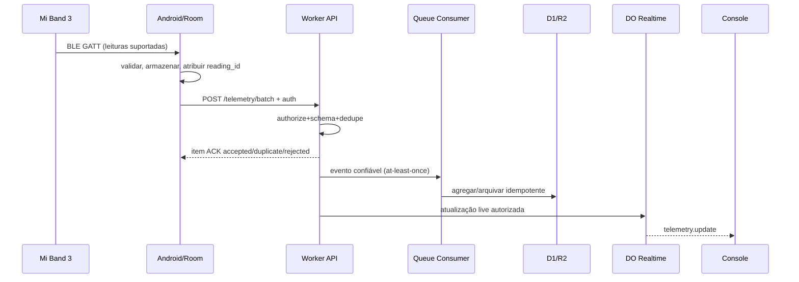
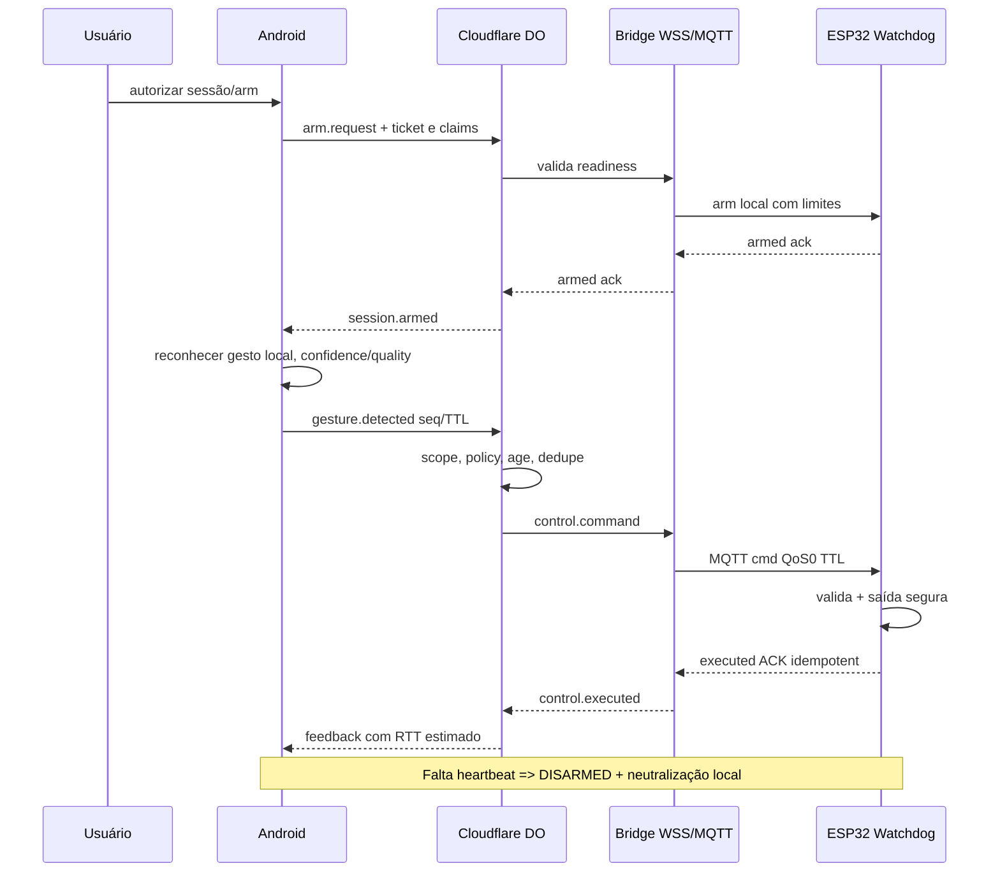
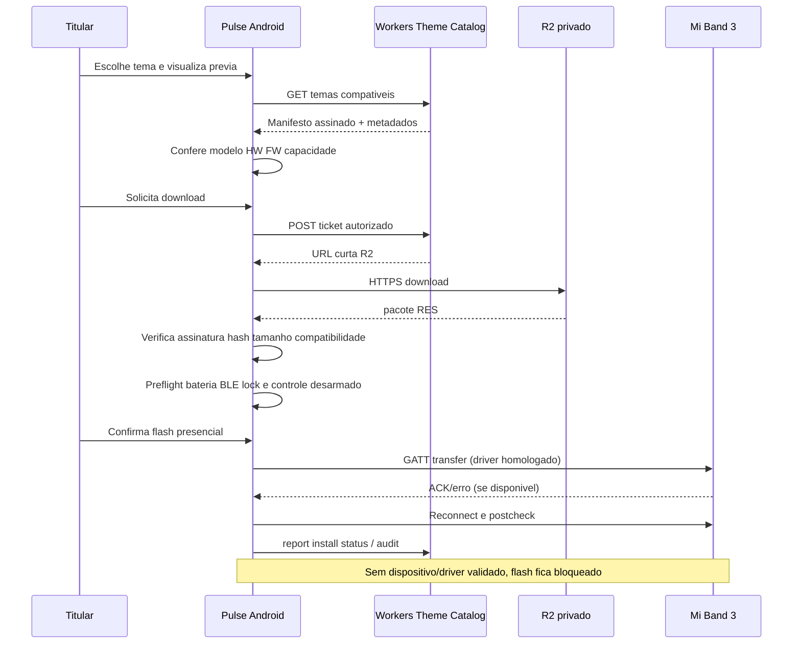

# 33 — Diagramas de sequência de protocolos

## Coleta e sincronização

```mermaid
sequenceDiagram
 participant B as Mi Band 3
 participant A as Android/Room
 participant W as Worker API
 participant Q as Queue Consumer
 participant D as D1/R2
 participant R as DO Realtime
 participant C as Console
 B->>A: BLE GATT (leituras suportadas)
 A->>A: validar, armazenar, atribuir reading_id
 A->>W: POST /telemetry/batch + auth
 W->>W: authorize+schema+dedupe
 W-->>A: item ACK accepted/duplicate/rejected
 W->>Q: evento confiável (at-least-once)
 Q->>D: agregar/arquivar idempotente
 W->>R: atualização live autorizada
 R-->>C: telemetry.update
```

## Controle de LED por gesto

```mermaid
sequenceDiagram
 participant U as Usuário
 participant A as Android
 participant R as Cloudflare DO
 participant M as Bridge WSS/MQTT
 participant E as ESP32 Watchdog
 U->>A: autorizar sessão/arm
 A->>R: arm.request + ticket e claims
 R->>M: valida readiness
 M->>E: arm local com limites
 E-->>M: armed ack
 M-->>R: armed ack
 R-->>A: session.armed
 A->>A: reconhecer gesto local, confidence/quality
 A->>R: gesture.detected seq/TTL
 R->>R: scope, policy, age, dedupe
 R->>M: control.command
 M->>E: MQTT cmd QoS0 TTL
 E->>E: valida + saída segura
 E-->>M: executed ACK idempotent
 M-->>R: control.executed
 R-->>A: feedback com RTT estimado
 Note over A,E: Falta heartbeat => DISARMED + neutralização local
```

## Theme Studio / instalação BLE sem comando remoto

```mermaid
sequenceDiagram
 participant U as Titular
 participant APP as Pulse Android
 participant W as Workers Theme Catalog
 participant R as R2 privado
 participant BAND as Mi Band 3
 U->>APP: Escolhe tema e visualiza previa
 APP->>W: GET temas compativeis
 W-->>APP: Manifesto assinado + metadados
 APP->>APP: Confere modelo HW FW capacidade
 U->>APP: Solicita download
 APP->>W: POST ticket autorizado
 W-->>APP: URL curta R2
 APP->>R: HTTPS download
 R-->>APP: pacote RES
 APP->>APP: Verifica assinatura hash tamanho compatibilidade
 APP->>APP: Preflight bateria BLE lock e controle desarmado
 U->>APP: Confirma flash presencial
 APP->>BAND: GATT transfer (driver homologado)
 BAND-->>APP: ACK/erro (se disponivel)
 APP->>BAND: Reconnect e postcheck
 APP->>W: report install status / audit
 Note over APP,BAND: Sem dispositivo/driver validado, flash fica bloqueado
```
